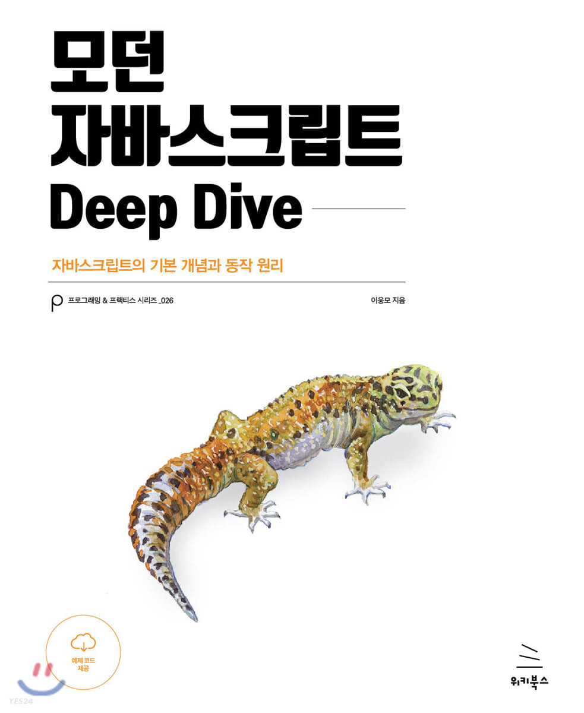

# 😤 모던자바스크립트 Deep Dive 스터디 😤

## 🐥 스터디 멤버 🐥

|  |  |
| :-----------------------------------------------------------------------: | :-----------------------------------------------------------------------: |
|                   [박예은](https://github.com/yengniws)                   |                   [손용현](https://github.com/joy10529)                   |
|     스스로 어려움 없이  자바스크립트 코드를 작성하는 능력 양성🤗     |                         자바스크립트 완벽 정독😁                          |

## ✅ 스터디 목표 ✅

💡자바스크립트라는 언어에 대한 개념을 정확하게 파악하고, 혼자 코드를 어려움 없이 작성하는 능력을 기르는 것을 목표로 한다. 

💡또한 블로그와 깃허브 사용을 통해 포트폴리오의 질을 높이고, 기록하는 습관을 들인다. 

💡팀원들과 토론하고 견해를 나누며 견문의 폭을 넓힌다. 

## 📌 스터디 진행 방법 📌

1️⃣ 매주 정해진 분량을 공부해 각자의 블로그와 깃허브에 정리하고, 제출 마감일 전에 과제 제출 페이지에 블로그 링크와 깃허브 pr 여부를 체크한다. (과제) 

2️⃣ 정기 모임일에 각자 공부한 내용을 발표하고 모르는 내용을 질문하며 견문을 나눈다. 단, 발표는 한 단원 씩 돌아가며 발표한다. 

3️⃣ 모든 회차가 다 끝난 후에 블로그에 스터디 회고록 작성을 통해 활동을 마무리 한다. 

4️⃣ 추가 논의 사항: 9회차 이후(개강 후) 스터디 어떤 방식으로 진행할지 결정 (예: 주말에 온라인으로 진행) 

## 🔎 과제제출 방법 🔎

- 매주 정해진 분량을 공부해 각자의 블로그와 깃허브에 정리하고, 제출 마감일 전에 과제 제출 페이지에 블로그 링크와 깃허브 PR 여부를 체크한다. 

**블로그**

- 해당 파트 분량 요약+참고한 인사이트(블로그 링크 또는 강의 링크)+몰랐던 부분에 대한 추가 설명+중요하다고 생각한 부분+토론 주제+학습 내용과 관련된 퀴즈 등  

**깃허브**

- n 단원 정리 시 해당 단원 폴더로 들어가 내이름.md 파일을 만들어 내용을 정리한다. 
- n 단원 폴더 내부에 있는 n단원.md 파일에는 팀원들의 블로그를 링크한다. 
- 팀원의 PR을 확인한 후 최소 1개 이상의 코멘트를 작성한다. (리뷰, 질문 등)

- 커밋 컨벤션은 다음과 같다: 
  Feat: 새로운 기능에 대한 커밋 
  Fix: 수정에 대한 커밋 
  Chore: 그 외 자잘한 수정에 대한 커밋(기타 변경) 
  Docs: 문서 수정에 대한 커밋 
  Style: 코드 스타일 혹은 포맷 등에 관한 커밋 
  Refactor: 코드 리팩토링에 대한 커밋 

- PR 컨벤션은 다음과 같다: 
  // 예시. 00장, 테스트 및 연습인 경우 

본인이름\_00 테스트 및 연습 

## ⌛ 커리큘럼 ⌛

| 회차 (과제 제출 기한) |                                                                       목차                                                                        |
| :-------------------: | :-----------------------------------------------------------------------------------------------------------------------------------------------: |
|   1주차 (당일 제출)   |           01 프로그래밍, 02 자바스크립트란?, 03 자바스크립트 개발 환경과 실행 방법(1p~33p) +블로그 작성 방법 및 깃허브 사용 방법 익히기           |
|    2주차 (~240705)    |                                           04 변수, 05 표현식과 문, 06 데이터 타입, 07 연산자 (34p~92p)                                            |
|    3주차 (~240712)    |                             08 제어문, 09 타입 변환과 단축 평가, 10 객체 리터럴, 11 원시 값과 객체의 비교 (93p~153p)                              |
|    4주차 (~240719)    |              12 함수, 13 스코프, 14 전역 변수의 문제점, 15 let, const 키워드와 블록 레벨 스코프, 16 프로퍼티 어트리뷰트 (154p~233p)               |
|    5주차 (~240726)    |                  17 생성자 함수에 의한 객체 생성, 18 함수와 일급 객체, 19 프로토타입, 20 strict mode, 21 빌트인 객체 (234p~341p)                  |
|    6주차 (~240802)    |                                            22 this, 23 실행 컨텍스트, 24 클로저, 25 클래스 (342p~468p)                                            |
|    7주차 (~240809)    |                                              26 ES6 함수의 추가 기능, 27 배열, 28 Number (469p~560p)                                              |
|    8주차 (~240816)    | 29 Math, 30 Date, 31 RegExp, 32 String, 33 7번째 데이터 타입 Symbol, 34 이터러블, 35 스프레드 문법,36 디스트럭처링 할당, 37 Set과 Map (561p~660p) |
|    9주차 (~240823)    |                                              38 브라우저 렌더링 과정, 39 DOM, 40 이벤트 (661p~799p)                                               |
|     10주차 (미정)     |                                                          미정(41장-49장 남음→800p-914p)                                                           |

## 🍀 활동 규칙 🍀

1️⃣ 과제 지각 또는 미제출 시 벌금 5000원을 부과한다. 

2️⃣ 매주 번갈아가며 모임 장소를 정한다. 

3️⃣ 모던 자바스크립트 교재와 노트북을 필수로 지참한다. 

4️⃣ 책임감을 가지고 진지하게 스터디에 임한다. 

5️⃣ 부득이하게 오프라인으로 활동을 진행하지 못하는 차시에는 온라인으로 활동을 대체한다. 
